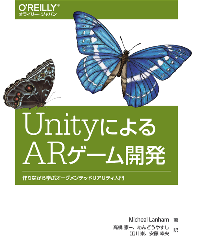

# UnityによるARゲーム開発

---

---

本リポジトリはオライリー・ジャパン発行書籍『[UnityによるARゲーム開発](http://www.oreilly.co.jp/books/9784873118109/)』（原書名『[Augmented Reality Game Development](https://www.packtpub.com/application-development/augmented-reality-game-development)』）のサポートサイトです。

* [リソースファイル](#サンプルコード)
* [完成状態のプロジェクト](#完成状態のプロジェクト)
* [正誤表](https://github.com/oreilly-japan/augmented-reality-game-development-ja/wiki/errata)

## フォーラム

ARやVRについて日本語で質問できる[フォーラム](https://groups.google.com/d/forum/vr_ar_ja)があります。
お気軽にご参加ください。本書の翻訳者も参加していますので、本書に関することも質問して頂けます。

## サンプルコード

サンプルコードの解説は本書籍をご覧ください。

### リソースファイル

本書のプロジェクト（FoodyGO）を完成させるには下記リソースファイルが必要です。各章で使うリソースパッケージを下記のリンクからダウンロードしてご使用ください。

* [2章用：Chapter2.unitypackage](https://github.com/oreilly-japan/augmented-reality-game-development-ja/raw/master/resources/Chapter2.unitypackage)
* [3章用：Chapter3.unitypackage](https://github.com/oreilly-japan/augmented-reality-game-development-ja/raw/master/resources/Chapter3.unitypackage)
* [4章用-その1：Chapter4_import1.unitypackage](https://github.com/oreilly-japan/augmented-reality-game-development-ja/raw/master/resources/Chapter4_import1.unitypackage)
* [4章用-その2：Chapter4_import2.unitypackage](https://github.com/oreilly-japan/augmented-reality-game-development-ja/raw/master/resources/Chapter4_import2.unitypackage)
* [5章用-その1：Chapter5_import1.unitypackage](https://github.com/oreilly-japan/augmented-reality-game-development-ja/raw/master/resources/Chapter5_import1.unitypackage)
* [5章用-その2：Chapter5_import2.unitypackage](https://github.com/oreilly-japan/augmented-reality-game-development-ja/raw/master/resources/Chapter5_import2.unitypackage)
* [6章用-その1：Chapter6_import1.unitypackage](https://github.com/oreilly-japan/augmented-reality-game-development-ja/raw/master/resources/Chapter6_import1.unitypackage)
* [6章用-その2：Chapter6_import2.unitypackage](https://github.com/oreilly-japan/augmented-reality-game-development-ja/raw/master/resources/Chapter6_import2.unitypackage)
* [7章用-その1：Chapter7_import1.unitypackage](https://github.com/oreilly-japan/augmented-reality-game-development-ja/raw/master/resources/Chapter7_import1.unitypackage)
* [7章用-その2：Chapter7_import2.unitypackage](https://github.com/oreilly-japan/augmented-reality-game-development-ja/raw/master/resources/Chapter7_import2.unitypackage)
* [8章用：Chapter8_import1.unitypackage](https://github.com/oreilly-japan/augmented-reality-game-development-ja/raw/master/resources/Chapter8_import1.unitypackage)
* [9章用：Chapter9_Firebase.unitypackage](https://github.com/oreilly-japan/augmented-reality-game-development-ja/raw/master/resources/Chapter9_Firebase.unitypackage)
* [10章用：Chapter10_debugging.unitypackage](https://github.com/oreilly-japan/augmented-reality-game-development-ja/raw/master/resources/Chapter10_debugging.unitypackage)
* [10章用：Chapter10.unitypackage](https://github.com/oreilly-japan/augmented-reality-game-development-ja/raw/master/resources/Chapter10.unitypackage)

### 完成状態のプロジェクト
各章ごとに終了時点の状態のUnityプロジェクトをこのリポジトリでブランチを分けて保存してあります。ブランチを切り替えることで各章の状態を参照可能です。

また、下記の各章のリンクからzipファイルでダウンロードすることもできます。
ZIPファイルのダウンロード後、展開してご使用ください。

（Windowsでファイルのパス名が長すぎるというエラーが発生する場合は、[7-Zip](https://sevenzip.osdn.jp/)等の圧縮・展開ソフトウェアでの展開を試してみてください。）

* [1章：Chapter_1_End](https://github.com/oreilly-japan/augmented-reality-game-development-ja/archive/Chapter_1_End.zip)
* [2章：Chapter_2_End](https://github.com/oreilly-japan/augmented-reality-game-development-ja/archive/Chapter_2_End.zip)
* [3章：Chapter_3_End](https://github.com/oreilly-japan/augmented-reality-game-development-ja/archive/Chapter_3_End.zip)
* [4章：Chapter_4_End](https://github.com/oreilly-japan/augmented-reality-game-development-ja/archive/Chapter_4_End.zip)
* [5章：Chapter_5_End](https://github.com/oreilly-japan/augmented-reality-game-development-ja/archive/Chapter_5_End.zip)
* [6章：Chapter_6_End](https://github.com/oreilly-japan/augmented-reality-game-development-ja/archive/Chapter_6_End.zip)
* [7章：Chapter_7_End](https://github.com/oreilly-japan/augmented-reality-game-development-ja/archive/Chapter_7_End.zip)
* [8章（完成状態）：Chapter_8_End](https://github.com/oreilly-japan/augmented-reality-game-development-ja/archive/Chapter_8_End.zip)

* [付録 A：Chapter_11a_End](https://github.com/oreilly-japan/augmented-reality-game-development-ja/archive/Chapter_11a_End.zip)
* [付録 B：Chapter_12b_End](https://github.com/oreilly-japan/augmented-reality-game-development-ja/archive/Chapter_12b_End.zip)

#### 使用方法

上記各章ごとのリンクからダウンロードするとzip形式の圧縮ファイルでダウンロードされるので展開します。
Unityでプロジェクトを開く際に`FoodyGO`フォルダーを指定してください。
ただし、Unity標準アセットは含まれていないので、プロジェクトをUnityで開いたら次の手順で必要なものをインポートしてください。

1. メインメニューの［Assets］を選択します。それから［Import Package］→［Cameras］の順に操作します。
2. インポート可能なすべてのものをリスト表示したインポートダイアログがポップアップするので［Import］をクリックします。
3. 同様にして［Assets］→［Import Package］→［Characters］の順に操作し、ポップアップしたインポートダイアログで［Import］をクリックします。
4. 同様にして［Assets］→［Import Package］→［CrossPlatformInput］の順に操作し、ポップアップしたインポートダイアログで［Import］をクリックします。
5. 同様にして［Assets］→［Import Package］→［ParticleSystems］の順に操作し、ポップアップしたインポートダイアログで［Import］をクリックします。
6. Projectパネルの`Assets`を選択し、シーン（Unityのロゴがアイコンになっているもの）をダブルクリックして開くとSceneビューにオブジェクトが表示されます。

## 実行環境

日本語版で検証に使用した各ソフトウェアのバージョン、およびハードウェアは次のとおりです。

#### ソフトウェア

* Unity 5.6.2f1
* Android SDK API level 23
* Xcode 8.3.3

#### ハードウェア（括弧内はOSのバージョン）

* ASUS ZenFone AR（Android 7.0）
* Nexus 5X（Android 7.1.1）
* iPhone SE（iOS 10.3.2）
* MacBook Pro Retina, 13-inch, Mid 2014（Mac OS X 10.11.5）

※ 付録AのプロジェクトにはUnityの5.6.x系のバージョンを使う必要があります。現時点ではTangoのSDKがUnity 2017.1に対応していないためです。

※ 付録BのプロジェクトにはXcode 9.0 beta以降、およびiOS 11 beta以降が必要です。

## 正誤表

正誤表は[Wiki](https://github.com/oreilly-japan/augmented-reality-game-development-ja/wiki/errata)に移動しました。

